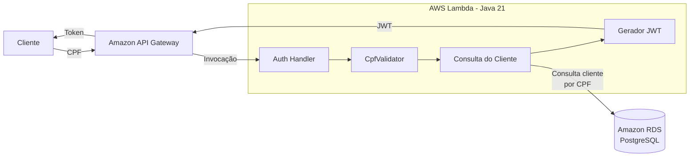

# Tech Challenge Oficina - Auth

Componente serverless responsável pela autenticação de clientes por CPF no ecossistema do Tech Challenge Oficina FIAP.

A aplicação é uma AWS Lambda desenvolvida em Java 21. Ela recebe uma requisição HTTP no formato de evento do API Gateway HTTP API v2, valida o CPF informado, consulta o cliente em um banco PostgreSQL e, quando o cliente existe e está ativo, gera um JWT para uso posterior pela API principal.

## Responsabilidades

- Receber um CPF no corpo da requisição.
- Validar o CPF antes de consultar o banco.
- Consultar a tabela `clientes` no PostgreSQL usando JDBC.
- Verificar se o cliente existe.
- Verificar se o cliente está ativo.
- Gerar um JWT quando a autenticação é autorizada.
- Retornar respostas de erro adequadas quando a requisição é inválida, o CPF é inválido, o cliente não existe, o cliente está inativo ou ocorre erro interno.

## Tecnologias

- Java 21
- AWS Lambda
- AWS Lambda Java Core
- AWS Lambda Java Events
- PostgreSQL/JDBC
- JWT com `jjwt`
- Jackson
- Maven
- JUnit 5
- Terraform
- GitHub Actions

O código da Lambda utiliza os tipos `APIGatewayV2HTTPEvent` e `APIGatewayV2HTTPResponse`, mas este repositório não provisiona API Gateway.

## Arquitetura

Fluxo conceitual:

```text
Cliente -> API Gateway -> Lambda Auth -> RDS PostgreSQL -> JWT
```

A Lambda Auth é o componente serverless de autenticação por CPF. A exposição HTTP pelo API Gateway deve existir fora deste repositório ou ser integrada por outro componente de infraestrutura.

## Diagrama da arquitetura



## Fluxo de autenticação

1. O API Gateway invoca a Lambda enviando um evento HTTP API v2.
2. O `AuthHandler` lê o corpo da requisição e tenta convertê-lo para `AuthRequest`.
3. Se o evento, o corpo ou o JSON forem inválidos, a Lambda retorna `400`.
4. O CPF recebido é validado por `CpfValidator`.
5. Se o CPF for inválido, a Lambda retorna `400`.
6. O CPF é normalizado para conter somente números.
7. O repositório `JdbcClienteRepository` consulta a tabela `clientes` pelo campo `cpf_cnpj`, também normalizado no SQL com `regexp_replace`.
8. Se nenhum cliente for encontrado, a Lambda retorna `404`.
9. Se o cliente existir, mas o campo `ativo` for falso, a Lambda retorna `403`.
10. Se o cliente existir e estiver ativo, `JwtService` gera um JWT.
11. A Lambda retorna `200` com o token e a mensagem de sucesso.

## Validação de CPF

A classe `CpfValidator` implementa a validação com as seguintes regras:

- Remove todos os caracteres não numéricos.
- Exige exatamente 11 dígitos.
- Rejeita CPFs formados por uma sequência de dígitos iguais.
- Calcula e valida os dois dígitos verificadores oficiais do CPF.

## Entrada e saída

### Requisição

Formato esperado no corpo da requisição:

```json
{
  "cpf": "123.456.789-09"
}
```

O CPF pode conter pontuação, pois a aplicação remove caracteres não numéricos durante a validação e a consulta.

### Resposta de sucesso

Status HTTP: `200`

```json
{
  "token": "jwt-gerado-pela-lambda",
  "message": "Autenticação realizada com sucesso."
}
```

### Principais respostas de erro

| Status | Mensagem | Quando ocorre |
| --- | --- | --- |
| `400` | `Requisição inválida.` | Evento vazio, corpo vazio ou JSON inválido. |
| `400` | `CPF inválido.` | CPF ausente, malformado ou com dígitos verificadores inválidos. |
| `404` | `Cliente não encontrado.` | CPF válido, mas sem cliente correspondente no banco. |
| `403` | `Cliente inativo.` | Cliente encontrado com `ativo = false`. |
| `500` | `Erro interno.` | Falha inesperada, incluindo erro de configuração, banco ou geração do token. |

Todas as respostas são retornadas com `Content-Type: application/json` e o formato:

```json
{
  "token": null,
  "message": "Mensagem de retorno."
}
```

## JWT

O JWT identifica o cliente autenticado para uso posterior pela API principal. O token é assinado com HS256 usando uma chave derivada por SHA-256 a partir da variável `JWT_SECRET`.

Claims geradas atualmente:

| Claim | Origem |
| --- | --- |
| `sub` | CPF normalizado do cliente, somente números. |
| `clienteId` | Campo `id` retornado da tabela `clientes`. |
| `nome` | Campo `nome` retornado da tabela `clientes`. |
| `tipo` | Valor fixo `CLIENTE`. |
| `iat` | Data/hora de emissão. |
| `exp` | Data/hora de expiração. |

A expiração implementada é de 1 hora a partir da emissão.

## Variáveis de ambiente

| Variável | Obrigatória | Sensível | Uso |
| --- | --- | --- | --- |
| `DB_HOST` | Sim | Não | Host do PostgreSQL. |
| `DB_PORT` | Não | Não | Porta do PostgreSQL. Quando ausente, usa `5432`. |
| `DB_NAME` | Sim | Não | Nome do banco de dados. |
| `DB_USER` | Sim | Não | Usuário de conexão com o banco. |
| `DB_PASSWORD` | Sim | Sim | Senha de conexão com o banco. |
| `JWT_SECRET` | Sim | Sim | Segredo usado para assinatura dos JWTs. |

No Terraform deste repositório, a Lambda recebe:

- `DB_HOST` a partir do endereço da instância RDS `tech-challenge-oficina-postgres`.
- `DB_PORT` a partir da porta da instância RDS.
- `DB_NAME` com valor `oficina`.
- `DB_USER` com valor `oficina_admin`.
- `DB_PASSWORD` a partir da variável sensível `db_password`.
- `JWT_SECRET` a partir da variável sensível `jwt_secret`.

## Banco de dados

A consulta implementada espera a tabela `clientes` com, pelo menos, os campos:

- `id`
- `nome`
- `cpf_cnpj`
- `ativo`

SQL utilizado pela Lambda:

```sql
SELECT id, nome, cpf_cnpj, ativo
FROM clientes
WHERE regexp_replace(cpf_cnpj, '[^0-9]', '', 'g') = ?
LIMIT 1
```

## Terraform

Os arquivos Terraform ficam em `terraform/` e provisionam os recursos necessários para a Lambda Auth.

Recursos criados por este repositório:

- `aws_lambda_function.auth`
  - Nome: `tech-challenge-oficina-auth`
  - Runtime: `java21`
  - Handler: `br.com.fiap.oficina.auth.handler.AuthHandler::handleRequest`
  - Artefato: `target/tech-challenge-oficina-auth.jar`
  - Memória: `512 MB`
  - Timeout: `15 s`
  - Execução dentro de VPC
- `aws_iam_role.lambda`
  - Role de execução da Lambda.
- `aws_iam_role_policy_attachment.lambda_basic_execution`
  - Anexa `AWSLambdaBasicExecutionRole`.
- `aws_iam_role_policy_attachment.lambda_vpc_access`
  - Anexa `AWSLambdaVPCAccessExecutionRole`.
- `aws_security_group.lambda`
  - Security group da Lambda.
  - Permite egress TCP `5432` para o CIDR da VPC compartilhada.

Data sources utilizados:

- `aws_vpc.shared`
  - Busca uma VPC com tags `Project = tech-challenge-oficina` e `Environment = shared`.
- `aws_subnets.private`
  - Busca subnets privadas na VPC compartilhada com tag `Tier = private`.
- `aws_db_instance.postgres`
  - Busca a instância RDS `tech-challenge-oficina-postgres`.

Este repositório não cria RDS, VPC, subnets, API Gateway, rotas HTTP ou Swagger/OpenAPI.

## Remote State

O backend remoto S3 está configurado em `terraform/versions.tf`:

| Configuração | Valor |
| --- | --- |
| Bucket | `tech-challenge-oficina-terraform-state-b1cfa326` |
| Key | `auth/terraform.tfstate` |
| Região | `us-east-1` |
| Criptografia | `encrypt = true` |
| Lock | `use_lockfile = true` |

## Build

Executar testes:

```bash
mvn test
```

Gerar o pacote da aplicação:

```bash
mvn package
```

Gerar o artefato da Lambda sem executar testes:

```bash
mvn clean package -DskipTests
```

O artefato esperado pelo Terraform é:

```text
target/tech-challenge-oficina-auth.jar
```

O `pom.xml` usa `maven-shade-plugin` para empacotar a aplicação e suas dependências em um JAR executável pela Lambda.

## Execução e testes locais

O projeto possui testes unitários com JUnit 5 para validação de CPF, geração de JWT e comportamento do handler.

```bash
mvn test
```

Não há servidor local, Docker Compose ou emulador de Lambda configurado neste repositório.

## CI/CD

O workflow `.github/workflows/ci-cd.yml` executa CI/CD para as branches `homolog` e `main`.

Gatilhos:

- `push` para `homolog` e `main`.
- `pull_request` para `homolog` e `main`.
- `workflow_dispatch`.

Job `CI`:

- Faz checkout do código.
- Configura Java 21 com distribuição Temurin.
- Usa cache Maven.
- Seleciona `./mvnw` se existir; caso contrário, usa `mvn`.
- Executa `mvn -B test`.
- Executa `mvn -B package -DskipTests`.
- Configura Terraform.
- Executa `terraform fmt -check`.
- Executa `terraform init -backend=false -input=false`.
- Executa `terraform validate`.
- Publica o artefato `target/tech-challenge-oficina-auth.jar`.

Job `Deploy Lambda`:

- Executa somente em `push` ou execução manual nas branches `homolog` e `main`.
- Não executa em `pull_request`.
- Usa o environment `homolog` para a branch `homolog`.
- Usa o environment `production` para a branch `main`.
- Baixa o JAR gerado no job de CI.
- Autentica na AWS via GitHub OIDC usando `aws-actions/configure-aws-credentials`.
- Assume a role definida em `vars.AWS_DEPLOY_ROLE_ARN`.
- Executa `terraform init`.
- Executa `terraform apply -auto-approve -input=false`.

Secrets e variables usados pelo workflow:

| Nome | Tipo | Uso |
| --- | --- | --- |
| `AWS_DEPLOY_ROLE_ARN` | GitHub Environment Variable | Role AWS assumida via OIDC para deploy. |
| `DB_PASSWORD` | GitHub Environment Secret | Valor de `TF_VAR_db_password`. |
| `JWT_SECRET` | GitHub Environment Secret | Valor de `TF_VAR_jwt_secret`. |

## Estratégia de branches

- `homolog`: branch de homologação.
- `main`: branch de produção.
- Alterações devem ser propostas via Pull Request.
- O workflow valida Pull Requests para `homolog` e `main`.
- O deploy por Terraform ocorre após merge/push nas branches `homolog` ou `main`.
- As branches devem permanecer protegidas conforme o fluxo adotado pelo projeto.

## Segurança

- Segredos não devem ser versionados no repositório.
- `JWT_SECRET` é informação sensível e deve ser mantido em GitHub Secrets/Environments ou mecanismo equivalente.
- `DB_PASSWORD` é sensível e deve ser mantido fora do código.
- O arquivo `terraform.tfvars.example` contém apenas placeholders.
- A Lambda recebe permissões AWS por IAM role.
- O deploy usa GitHub OIDC para assumir uma role AWS, evitando credenciais AWS estáticas no workflow.
- A Lambda roda em subnets privadas e usa security group com saída para PostgreSQL na VPC compartilhada.
- A validação de CPF reduz chamadas desnecessárias ao banco e impede autenticação com CPF malformado.

## Dependências entre repositórios

Este repositório representa somente o componente de autenticação serverless. Ele depende de outros componentes do ecossistema para a solução completa:

- `tech-challenge-oficina-api`
  - API principal que deve consumir/validar o JWT emitido por esta Lambda.
  - Este repositório não contém a implementação da API principal.
- `tech-challenge-oficina-k8s-infra`
  - Infraestrutura Kubernetes da aplicação principal.
  - Não é provisionada por este repositório.
- `tech-challenge-oficina-database-infra`
  - Infraestrutura de banco/rede necessária para a Lambda, incluindo a VPC compartilhada, subnets privadas e a instância RDS PostgreSQL esperada pelo Terraform.
  - Este repositório apenas referencia esses recursos por data sources.

Não há submódulos, chamadas diretas ou automações entre esses repositórios no código atual deste projeto.

## Ordem de provisionamento

Antes de aplicar o Terraform deste repositório, a infraestrutura compartilhada precisa existir quando aplicável:

1. VPC compartilhada com tags `Project = tech-challenge-oficina` e `Environment = shared`.
2. Subnets privadas na VPC com tag `Tier = private`.
3. Instância RDS PostgreSQL com identificador `tech-challenge-oficina-postgres`.
4. Banco `oficina`, usuário `oficina_admin` e tabela `clientes` compatíveis com a consulta da Lambda.
5. Secrets/variables configurados no GitHub Environment correspondente.
6. Build do JAR `target/tech-challenge-oficina-auth.jar`.
7. Aplicação do Terraform deste repositório.

## Swagger

Este repositório não possui Swagger/OpenAPI.

A Lambda está preparada para receber eventos HTTP API v2 do API Gateway, mas a configuração de API Gateway, rotas públicas e documentação Swagger, quando existirem, devem estar em outro repositório ou componente de infraestrutura.
